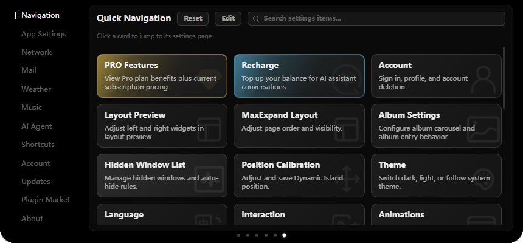
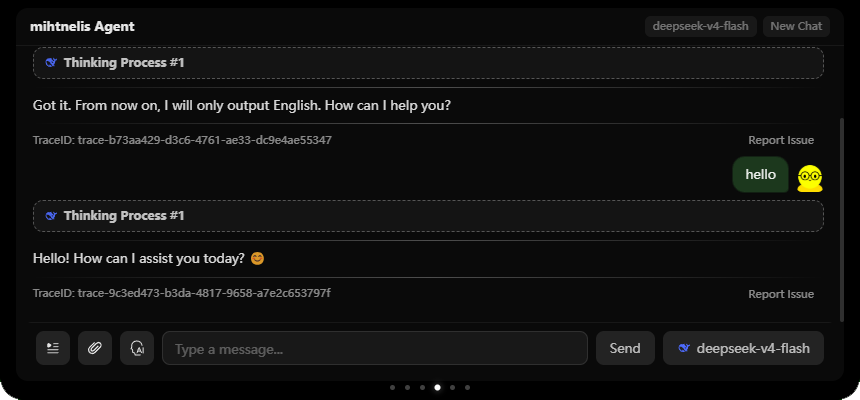
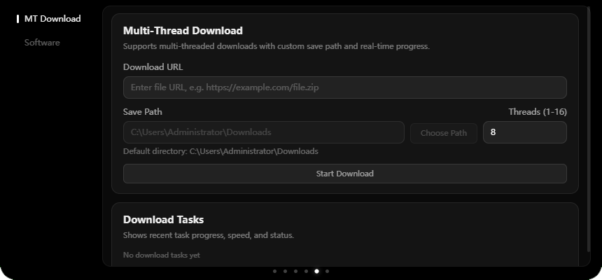

  <h1>&nbsp;eIsland</h1>
  
<strong>Dynamic Island-style desktop app for Windows</strong>

  
Built with Electron + React + TypeScript

  
Supports real-time weather, synced lyrics, timers, and quick system utility actions

  
  
  
  

---

> License note: This project is open-sourced under GPLv3 with additional clauses and supplements (see `LICENSE` for details).

## UI Preview

### Overview Screen

At-a-glance view of date, weather, countdowns, and quick launch tools

### Weather Screen

Live weather and forecast with both auto-location and manual configuration

### Lyrics Screen

Real-time synced lyrics with automatic matching from multiple lyric sources

### Settings Screen

Comprehensive customization for appearance, interaction behavior, and network configuration

### Agent Screen

Built-in AI agent workspace for intelligent assistance and streamlined productivity workflows

### Toolbox Screen

Practical utility panel with quick-access tools and common software actions

---

## Icon Credits

All icons used in this project are sourced from [iconfont](https://www.iconfont.cn/).

## Image Credits

The following images used in this project are from the Artemis II mission:

| Wallpaper Name | File Name | Capture Device | Original Link |
|---------------|-----------|----------------|---------------|
| Spaceship Earth | `art002e008487~orig.jpg` | iPhone 17 Pro Max | [images.nasa.gov](https://images.nasa.gov/details/art002e008487) |
| A Crescent Earth | `art002e004441~orig.jpg` | NIKON Z9 35mm f/2 | [images.nasa.gov](https://images.nasa.gov/details/art002e004441) |
| Thinking of You, Earth | `art002e008486~orig.jpg` | iPhone 17 Pro Max | [images.nasa.gov](https://images.nasa.gov/details/art002e008486) |

> All images are sourced from [NASA](https://www.nasa.gov/) (National Aeronautics and Space Administration)
>
> All NASA images in this repository are used under NASA's image usage policy and do not imply NASA endorsement of this project.

More Artemis II images are available at:
- https://images.nasa.gov/
- https://www.nasa.gov/artemis-ii-mobile-wallpapers/

## License & Legal

- Terms of Service: `LEGAL/TERMS_OF_SERVICE.md`
- Privacy Policy: `LEGAL/PRIVACY_POLICY.md`
- Billing & Refund Policy: `LEGAL/BILLING_REFUND_POLICY.md`

## License

This project is released under **GNU General Public License v3.0 (GPLv3)** or later (`GPL-3.0-or-later`).

Under GPLv3 Section 7(b), limited additional terms apply: the following author attributions must be retained in all copies, modified versions, and any Appropriate Legal Notices displayed by the program:

- Copyright (C) 2026-present JNTMTMTM (https://github.com/JNTMTMTM)
- Copyright (C) 2026-present pyisland.com (https://pyisland.com)

For full terms (including the standard GPLv3 text and additional clauses), see the `LICENSE` file in the repository root.